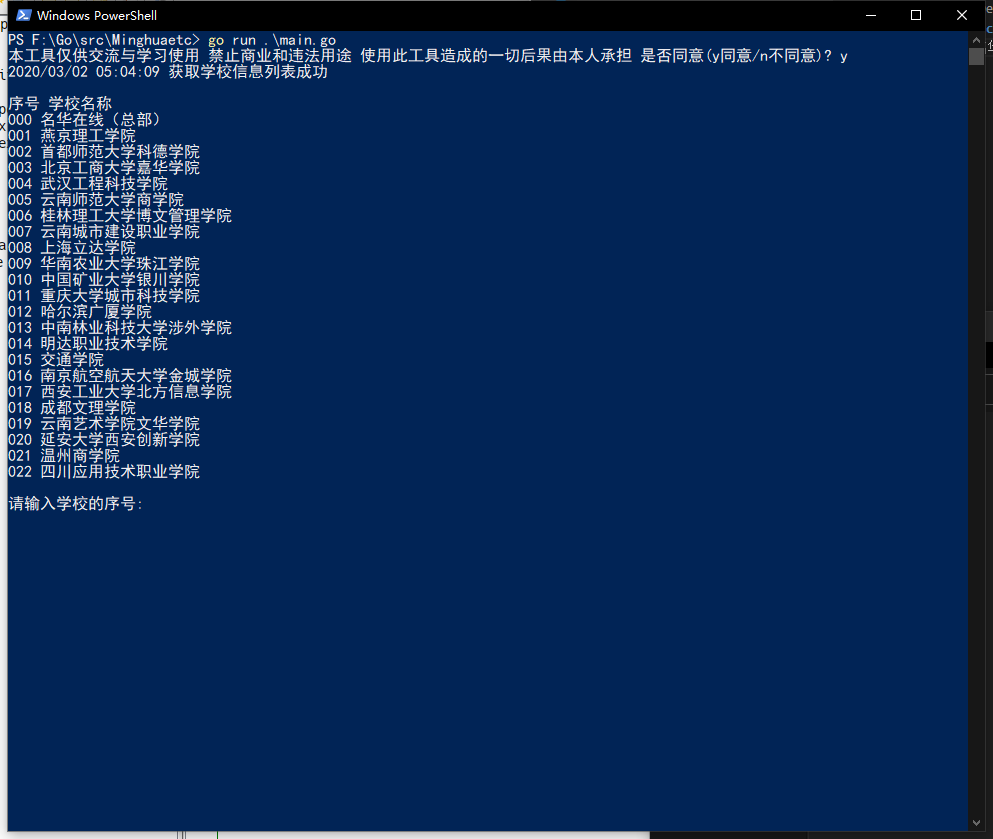
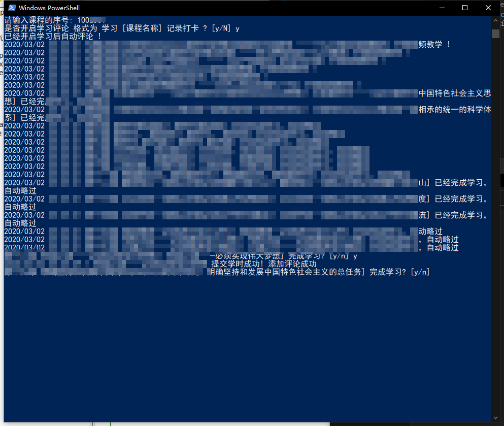

# minghuaetc hack Go
 Go 编写的名华慕课刷学时课时工具 基于 Android 客户端

# 更新说明

- 支持最新的客户端 Android _1.0.7_ 版本
- 支持一个课程一个课程的完成
- 添加学习后自动在课程下面评论

# 免责申明

本项目仅供交流与学习，请于下载的24小时内务必删除，切勿用作商业和非法用途，使用本项目造成的一切后果由本人自行承担

此外本项目不提供 __编译__ 、 __Release__ 版本，仅是 Go 语言学习的交流媒介和产物

# 预览图

